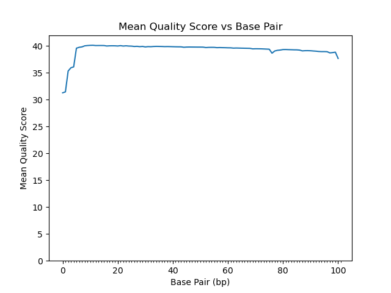
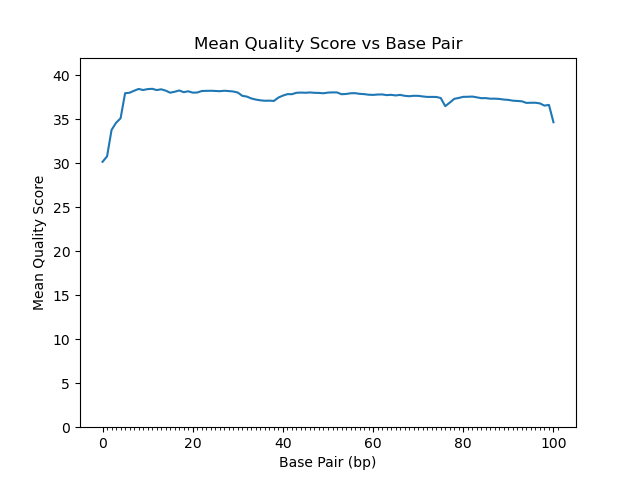
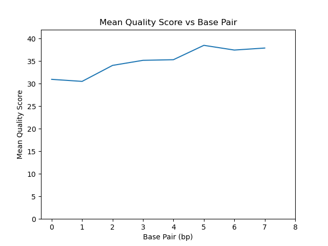

# Assignment the First

## Part 1
1. Be sure to upload your Python script. Provide a link to it here:

| File name | label | Read length | Phred encoding |
|---|---|---|---|
| 1294_S1_L008_R1_001.fastq.gz | read1 | 101 | +33 |
| 1294_S1_L008_R2_001.fastq.gz | index1 | 8 | +33 |
| 1294_S1_L008_R3_001.fastq.gz | index2 | 8 | +33 |
| 1294_S1_L008_R4_001.fastq.gz | read2 | 101 | +33 |

2. Per-base NT distribution

    1. Use markdown to insert your 4 histograms here.

    R1:
    
    R2:
    
    index1:
    
    index2:
    

    2. What is a good quality score cutoff for index reads and biological read pairs to utilize for sample identification and downstream analysis, respectively? Justify your answer.

    Anywhere between Q20 and Q30 would be appropriate. I would use Q20.
        
    Looking at the [illumina website's section on quality scores](https://www.illumina.com/science/technology/next-generation-sequencing/plan-experiments/quality-scores.html) Q30 is shown to be 'virtually perfect'. Looking at my histograms, all of the mean quality scores are above 30, but many are around 30, so I worry that would cut too many reads. Q20 is an error rate of 1 in 100 bp, so that seems a more appropriate bottom cutoff.

    3. How many indexes have undetermined (N) base calls? (Utilize your command line tool knowledge. Submit the command(s) you used. CHALLENGE: use a one-line command)

For index1: 
```
$ zcat 1294_S1_L008_R2_001.fastq.gz | grep -A 1 "^@" | grep -v "^@" | grep -v "^--$" | grep -c "N"
3976613
```

There are 363246735 records in the file, so 1.1% of the records in R1 have Ns.

For index 2:
```
$ zcat 1294_S1_L008_R3_001.fastq.gz | grep -A 1 "^@" | grep -v "^@" | grep -v "^--$" | grep -c "N"
3328051
```

0.92% of the indexes in R3 have Ns.
    
## Part 2

I want to demultiplex the files and report any index hopping that occurred. This means that reads with matching indexes are put into a match file for that index, nonmatching indexes are reported in a 'hopped' file, and indexes that do not match the input barcodes are reported to an 'unknown' file. An index can be unknown because it has a 'N' present or because it does not reach a quality score cutoff. Each set of files (each index, hopped, unknown) should have a file for R1 and R2.

#### Output:
- A R1 and R2 fastq file for each matching index. (R1_<index>.fastq and R2_<index>.fastq)
- A R1 and R2 fastq file for hopped reads. (R1_hopped.fastq and R2_hopped.fastq)
- A R1 and R2 fastq file for unknown reads. (Rq_unknown.fastq and R2_unknown.fastq)
- Print: The number of read-pairs with properly matched indexes (per index-pair), the number of read pairs with index-hopping observed, and the number of read-pairs with unknown index(es).

### High Level Functions:
```
def valid_indexes(file: path) -> dict:
    '''Takes an input file and returns a dictionary of valid illumina barcodes.'''
    return index_dict
Input: index_file.txt
Expected output: {
B1: GTAGCGTA, A5: CGATCGAT, C1:	GATCAAGG,
B9:	AACAGCGA, C9: TAGCCATG, C3: CGGTAATC,
B3	CTCTGGAT, C4: TACCGGAT, A11: CTAGCTCA,
C7	CACTTCAC, B2: GCTACTCT, A1: ACGATCAG,
B7: TATGGCAC, A3: TGTTCCGT, B4: GTCCTAAG,
A12: TCGACAAG, C10: TCTTCGAC, A2: ATCATGCG,
C2:	ATCGTGGT, A10: TCGAGAGT, B8: TCGGATTC,
A7:	GATCTTGC, B10: AGAGTCCA, A8: AGGATAGC
}

def lowest_qscore(qscore: str, phred33: bool) -> float:
    '''Takes a string of qscore and returns the lowest qscore across the string.'''
    return lowest_qscore
Input: ABCDE
Expected output: A
```

### Pseudocode:

Use function to make a list of valid indexes called "index_dict"

initialize counters of each type of index pair to print at end of analysis

Open all files

    for each line in files: # all files will have equal number of lines
    
        read1 = line from R1
        
        index1 = line from R2
        
        index2 = reverse complement of line from R3
        
        read2 = line from R4
        
        # check if indexes are valid indexes
        
        if index1 is in index_dict or doesnt pass lowest_qscore:
        
            write read1 with index headers to R1_unknown
            
            write read2 with index headers to R2_unknown
            
        elif index2 is in index_dict or doesnt pass lowest_qscore:
        
            write read1 with index headers to R1_unknown
            
            write read2 with index headers to R2_unknown
            
        else: # barcodes are valid!
        
            if index1 == index2:
            
                write read1 with index headers to R1_<index1>
                
                write read2 with index headers to R2_<index1>
                
            else: # index1 != index2:
            
                write read1 with index headers to R1_hopped
                
                write read2 with index headers to R2_hopped
